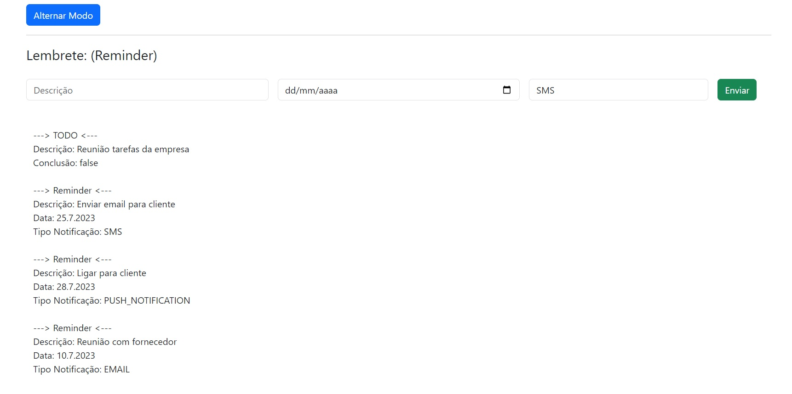

  <!--Adicionar logotipo do projeto aqui-->
  

    
  
 

  <h1>Lista de Tarefas</h1>
  
Projeto de uma lista de tarefas, que utiliza técnicas de TypeScript 
    Elaborado no curso de programação: DevSamurai (https://devsamurai.com.br)
  

  

    
  
 

  <!--Adicionar imagem/gif do projeto aqui-->
  

    
  

## 🚀 Iniciar

Para iniciar o projeto, basta abrir o arquivo "index.html" em seu navegador preferido.

## 🔨 Seja um dos contribuidores 

Quer fazer parte desse projeto? Clique [AQUI](CONTRIBUTING.md) e leia como contribuir.

<a href='#voltar-topo'>⬆ Voltar ao topo</a> 
